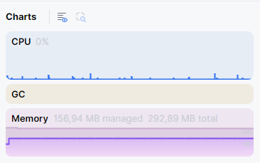

# Booking System (ABP Layered Demo)

A demonstration application for booking company resources (meeting rooms, workspaces, cars). The project showcases the **ABP Framework layered architecture** with **Domain-Driven Design**, **Razor Pages UI**, and **OpenIddict** authentication.

---

## Quick start

**Requirements:** [.NET 10 SDK](https://dotnet.microsoft.com/download/dotnet), [Node.js 18 or 20](https://nodejs.org/) (for client-side libraries)

```bash
# 1. Install client-side libraries (first clone / after adding UI packages)
abp install-libs

# 2. Run the web application (InMemory POC mode — no database setup required)
dotnet run --project src/Abp.Demo.Web
```

Open [https://localhost:5000/Account/Login](https://localhost:5000/Account/Login).

**Demo password for all users:** `1q2w3E*`  
On the login page, pick an account from the **Quick login (POC)** dropdown — username, password, and role are filled in automatically.

| Username | Role | Access |
|----------|------|--------|
| `admin` | Administrator | Full access (ABP admin + all booking permissions) |
| `manager` | Manager | Resources and bookings (full) |
| `employee` | Employee | View resources, create bookings |
| `viewer` | Viewer | Read-only |

### Reset demo data

In **InMemory POC mode** (default), the database is **recreated and re-seeded on every application start**. Simply restart `Abp.Demo.Web` to get a fresh dataset.

### Tests

```bash
dotnet test
```

### PostgreSQL mode (optional)

For a production-like setup:

```bash
docker compose up -d
dotnet run --project src/Abp.Demo.DbMigrator
dotnet run --project src/Abp.Demo.Web
```

Update `src/Abp.Demo.Web/appsettings.json`:

```json
"Database": {
  "Provider": "PostgreSql",
  "InitializeOnStartup": false
},
"ConnectionStrings": {
  "Default": "Host=localhost;Port=5432;Database=abp;Username=abp;Password=password"
}
```

Swagger UI (Development): [https://localhost:5000/swagger](https://localhost:5000/swagger)

---

## Application features

### Resources

- Types: **meeting rooms**, **workspaces**, **cars**
- CRUD: create, update, delete (permission-gated)
- Fields: name, description, location, capacity, active flag
- List with pagination and sorting

### Bookings

- Create bookings with resource, time slot, and purpose
- Next available slot lookup (`GET /api/app/booking/next-available-slot/{resourceId}`)
- Lifecycle: **Pending → Confirmed → Completed** or **Cancelled**
- Overlap checks and inactive-resource validation
- Resource-type rules: hourly slots for meeting rooms/cars, daily slots for workspaces

### Dashboard

- Counters: active resources, pending / confirmed / completed bookings
- Upcoming bookings table (home page)

### Permissions

Granular permissions (not roles only), managed via ABP Permission Management:

| Permission | Description |
|------------|-------------|
| `BookingSystem.Resources` | View resources |
| `BookingSystem.Resources.Create` | Create resources |
| `BookingSystem.Resources.Edit` | Edit resources |
| `BookingSystem.Resources.Delete` | Delete resources |
| `BookingSystem.Bookings` | View bookings |
| `BookingSystem.Bookings.Create` | Create bookings |
| `BookingSystem.Bookings.Cancel` | Cancel bookings |

Demo roles are seeded in InMemory mode (`manager`, `employee`, `viewer`). The `admin` role receives all permissions via ABP's standard identity seed.

### Authentication (OpenIddict + ABP Account)

Built on **ABP OpenIddict** and **ABP Identity** modules:

- Cookie-based login via Razor Pages (`/Account/Login`)
- OpenIddict token server for API clients and Swagger
- Dynamic claims and permission checks on every request
- Stale session cleanup when the InMemory database is recreated

### Platform modules (ABP)

Pre-installed ABP modules provide additional capabilities out of the box:

- **Identity** — users, roles, claims
- **Permission Management** — role and user permission grants
- **Feature Management**, **Setting Management**
- **Audit Logging** — entity and action auditing (ABP infrastructure)
- **Tenant Management** — available but disabled by default

---

## Architecture

### Overview

```
┌─────────────────────────────────────────────────────────────┐
│  Abp.Demo.Web (Razor Pages + LeptonX Lite theme)          │
│  MVC UI · Menu · Modals · Login page · Dashboard           │
└──────────────────────────┬──────────────────────────────────┘
                           │ Application service contracts
┌──────────────────────────▼──────────────────────────────────┐
│  Abp.Demo.HttpApi (optional REST controllers)               │
│  Auto API controllers generated from app services           │
└──────────────────────────┬──────────────────────────────────┘
                           │
┌──────────────────────────▼──────────────────────────────────┐
│  Abp.Demo.Application                                       │
│  Application services · DTO mapping · Authorization         │
└──────────────────────────┬──────────────────────────────────┘
                           │
┌──────────────────────────▼──────────────────────────────────┐
│  Abp.Demo.Application.Contracts                             │
│  DTOs · Service interfaces · Permissions                      │
└──────────────────────────┬──────────────────────────────────┘
                           │
┌──────────────────────────▼──────────────────────────────────┐
│  Abp.Demo.Domain                                            │
│  Entities · Domain services · Repository interfaces · ETOs  │
└──────────────────────────┬──────────────────────────────────┘
                           │
┌──────────────────────────▼──────────────────────────────────┐
│  Abp.Demo.EntityFrameworkCore                                 │
│  DbContext · Repositories · Migrations · InMemory / PostgreSQL│
└──────────────────────────┬──────────────────────────────────┘
                           │
┌──────────────────────────▼──────────────────────────────────┐
│  Abp.Demo.Domain.Shared                                     │
│  Enums · Constants · Localization · Shared options            │
└─────────────────────────────────────────────────────────────┘
```

### Solution structure

```
Abp.Demo/
├── src/
│   ├── Abp.Demo.Domain.Shared/       # Constants, enums, localization, ETOs
│   ├── Abp.Demo.Domain/              # Entities, domain services, seed contributors
│   ├── Abp.Demo.Application.Contracts/  # DTOs, interfaces, permission definitions
│   ├── Abp.Demo.Application/         # Application service implementations
│   ├── Abp.Demo.EntityFrameworkCore/ # EF Core, DbContext, repositories, migrations
│   ├── Abp.Demo.HttpApi/             # REST API layer (auto controllers)
│   ├── Abp.Demo.HttpApi.Client/     # C# client proxies
│   ├── Abp.Demo.Web/                 # Razor Pages host application
│   └── Abp.Demo.DbMigrator/          # Migration + seed console app
└── test/
    ├── Abp.Demo.Domain.Tests/
    ├── Abp.Demo.Application.Tests/
    ├── Abp.Demo.EntityFrameworkCore.Tests/
    └── Abp.Demo.Web.Tests/
```

### Backend (ABP Layered / DDD)

| Layer | Project | Responsibility |
|-------|---------|----------------|
| **Domain.Shared** | `Abp.Demo.Domain.Shared` | Enums (`ResourceType`, `BookingStatus`), constants, localization keys, permission names, `DatabaseOptions`. No dependencies. |
| **Domain** | `Abp.Demo.Domain` | Aggregates (`Resource`, `Booking`), `BookingManager`, repository interfaces, data seed contributors, domain events (ETOs). |
| **Application.Contracts** | `Abp.Demo.Application.Contracts` | DTOs, `IResourceAppService`, `IBookingAppService`, `DemoPermissionDefinitionProvider`. |
| **Application** | `Abp.Demo.Application` | Use-case orchestration, authorization, mapping to DTOs. No EF Core references. |
| **EntityFrameworkCore** | `Abp.Demo.EntityFrameworkCore` | `DemoDbContext`, `EfCoreBookingRepository`, migrations, InMemory / PostgreSQL providers. |
| **HttpApi** | `Abp.Demo.HttpApi` | Conventional API controllers (ABP auto-generates from app services). |
| **Web** | `Abp.Demo.Web` | Razor Pages UI, OpenIddict host, `DatabaseInitializationHostedService`, login page override. |
| **DbMigrator** | `Abp.Demo.DbMigrator` | Applies migrations and seeds data (PostgreSQL / CI pipelines). |

**Key patterns:**

- **Rich domain model** — `Booking` enforces status transitions and raises domain events
- **Domain service** — `BookingManager` handles conflict checks and resource validation
- **Custom repository** — `IBookingRepository` with overlap queries (`HasConflictAsync`)
- **Application services** — one service per aggregate area, `[Authorize]` per permission
- **DTO boundaries** — entities never exposed outside the application layer
- **Options pattern** — `DatabaseOptions` bound from `appsettings.json` (no hardcoded config reads)
- **Data seeding** — `IDataSeedContributor` implementations for users, roles, demo bookings
- **Module system** — each layer is an ABP module with explicit `DependsOn` dependencies

### Request flow (example)

1. User clicks **Confirm** on a booking in the Razor Pages UI
2. JavaScript calls the auto-generated API: `POST /api/app/booking/{id}/confirm`
3. ABP authorization checks `BookingSystem.Bookings` permission
4. `BookingAppService.ConfirmAsync` loads the aggregate via `IBookingRepository`
5. `booking.Confirm()` validates the status transition in the domain entity
6. Repository persists changes inside a unit of work
7. ABP audit logging records the change (infrastructure)
8. Updated `BookingDto` is returned to the UI

### UI (Razor Pages)

| Route | Description |
|-------|-------------|
| `/Account/Login` | Sign in (demo user dropdown in InMemory mode) |
| `/` | Dashboard with stats and upcoming bookings |
| `/Resources` | Resource management (DataTables + modals) |
| `/Bookings` | Bookings list, create, confirm, complete, cancel |

The UI uses the **LeptonX Lite** theme, ABP tag helpers (`abp-card`, `abp-modal`, `abp-table`), and server-rendered Razor Pages with modal-based create/edit flows.

---

## Architecture pros and cons

> **Context:** This project uses **ABP Framework** (layered template). A comparable hand-written stack lives in [`AI.Layered.Demo`](C:\Users\abirula.PM\Documents\Emergn\ABP\AI.Layered.Demo) — same booking domain, but **MediatR + Minimal API + React SPA**, no `Volo.Abp.*` packages.
>
> **AI note:** Today, tools like Cursor/Copilot can generate permissions, OpenIddict wiring, audit pipelines, and CRUD endpoints very quickly. *Writing from scratch is no longer the main bottleneck.* The real trade-off is **what you own long-term** vs **what a platform maintains for you**.

### ABP vs hand-written — at a glance

| Dimension | **This project (ABP Layered)** | **AI.Layered.Demo (hand-written)** |
|-----------|-------------------------------|-------------------------------------|
| **Projects in solution** | 9+ (Domain.Shared, Contracts, HttpApi, DbMigrator, …) | 5 (Domain, Application, Infrastructure, API, Tests) |
| **Application layer** | `ApplicationService` + Auto API controllers | MediatR Commands/Queries + Minimal API |
| **UI** | Razor Pages + LeptonX Lite | React 19 SPA (Feature-Sliced Design) |
| **Auth** | ABP Identity + OpenIddict modules | Custom OpenIddict 6 + own `User` entity |
| **Permissions** | `PermissionDefinitionProvider` + ABP Permission Management UI | Custom tables + `PermissionEndpointFilter` + `/admin/permissions` |
| **Auditing** | ABP Audit Logging module | Custom HTTP + EF interceptor + MediatR `AuditBehavior` |
| **Seeding / migrations** | `IDataSeedContributor`, `DbMigrator` | `DataSeeder` + startup `DatabaseInitializer` |
| **Time to first demo** | Slower setup (`abp install-libs`, more projects) | Faster (`dotnet run` + `npm build`) |
| **What AI accelerates most** | Business features *on top of* existing modules | Cross-cutting infra that ABP would otherwise provide |
| **What AI does not remove** | ABP version upgrades, module conventions, learning curve | Maintenance of every custom subsystem you generated |

### Pros of ABP (why not hand-write everything, even with AI?)

| Aspect | Why ABP still wins |
|--------|-------------------|
| **Cross-cutting is productized** | Identity, permissions, audit, settings, features, background jobs — implemented, documented, and versioned as modules — not one-off AI output you must own forever |
| **Upgrade path** | Security patches and breaking changes are tracked by the ABP team; you bump NuGet packages instead of re-auditing custom OpenIddict/permission code |
| **Conventions reduce drift** | `ApplicationService`, `IRepository`, `IDataSeedContributor`, `[Authorize]` — the whole team (and AI) follow the same playbook |
| **Enterprise hooks ready** | Multi-tenancy, localization, feature flags, blob storage, distributed events — available when requirements grow, without a rewrite |
| **Tooling ecosystem** | ABP Studio, CLI (`abp generate-proxy`, `abp install-libs`), commercial Suite — less manual glue |
| **AI works *with* the framework** | Prompts like "add app service + permission + Razor page" map cleanly to ABP layers; less architectural decision fatigue per feature |
| **Production patterns baked in** | `IClock`, `ICurrentUser`, `BusinessException` + localization, unit of work — fewer subtle bugs than regenerating equivalents |

### Cons of ABP (where hand-written + AI competes)

| Aspect | Why ABP can hurt                                                                                                             |
|--------|------------------------------------------------------------------------------------------------------------------------------|
| **Heavier footprint** | More assemblies, modules, and startup work — higher memory and cognitive load (see benchmark below)                          |
| **Framework coupling** | Business code inherits ABP base classes; migrating away later is expensive                                                   |
| **Boilerplate per feature** | Entity + Constants + DTOs + Interface + AppService + EF config + Razor Page + Permission — many files even if AI writes them |
| **Slower iteration for UI experiments** | Razor Pages + Lepton theme vs a modern React SPA — product UX may need a separate frontend anyway                            |
| **ABP-specific knowledge** | Juniors (and AI) can produce syntactically correct but non-idiomatic ABP code without understanding module boundaries        |
| **License / vendor** | **Commercial features and some tooling require Volosoft ecosystem buy-in**                                                   |
| **"Free" infra is not free** | **You pay in conventions, package alignment, and template weight — AI does not shrink the solution structure**                                                                                                                         |
| **Overkill for tiny domains** | A booking CRUD with 4 roles does not *need* 9 projects — ABP shines as the domain grows                                      |

**Practical rule:**

- Choose **ABP** when the product will accumulate **enterprise requirements** (tenancy, audit, granular permissions, modules, long maintenance) and you want a **stable platform** under AI-generated business code.
- Choose **hand-written** when you need a **lean deployable**, full **UI stack control** (e.g. React FSD), minimal dependencies, and the team accepts **owning every cross-cutting concern** — including everything AI initially generated.

### When this architecture (ABP Layered) makes sense

- Team standardizing on ABP for multiple products
- Backend-first delivery with admin UI via Razor Pages is acceptable
- Identity, permissions, and audit are required — but you do **not** want to maintain custom implementations
- Domain will grow beyond a demo (more aggregates, integrations, tenancy)

### When to prefer hand-written (see AI.Layered.Demo)

- SPA-first product with React/TypeScript as a first-class citizen
- Minimal dependencies and smaller runtime footprint matter
- Team wants MediatR/CQRS explicitly, not ABP application services
- You accept maintaining OpenIddict, permissions, and audit code yourself (even if AI wrote the first version)

### Memory usage

Lower footprint is often cited as a reason to avoid ABP. Measured comparison against the hand-written demo:



## Configuration

Main sections in `src/Abp.Demo.Web/appsettings.json`:

| Section | Purpose |
|---------|---------|
| `Database:Provider` | `InMemory` (default) or `PostgreSql` |
| `Database:InitializeOnStartup` | Auto-create schema and seed on web app start (default `true` for POC) |
| `Database:InMemoryDatabaseName` | Shared InMemory store name |
| `ConnectionStrings:Default` | PostgreSQL connection string (when `Provider` is `PostgreSql`) |
| `App:SelfUrl` | Public URL of the application (`https://localhost:5000`) |
| `AuthServer:Authority` | OpenIddict issuer (must match `App:SelfUrl`) |

Options classes live in `Abp.Demo.Domain.Shared` (e.g. `DatabaseOptions`) and are bound via DI — configuration keys are not read directly in application code.

**Production OpenIddict certificate:** place `openiddict.pfx` in the Web project root and configure `AuthServer:CertificatePassPhrase`. See [ABP OpenIddict deployment docs](https://abp.io/docs/latest/Deployment/Configuring-OpenIddict).

---

## Additional resources

- [ABP Layered Web Application Template](https://abp.io/docs/latest/solution-templates/layered-web-application)
- [ABP Domain Driven Design](https://abp.io/docs/latest/framework/architecture/domain-driven-design)
- [Web Application Development Tutorial](https://abp.io/docs/latest/tutorials/book-store/part-1)
- [ABP Deployment Guide](https://abp.io/docs/latest/Deployment/Index)

---

## License

Demonstration project for learning and internal experiments.
